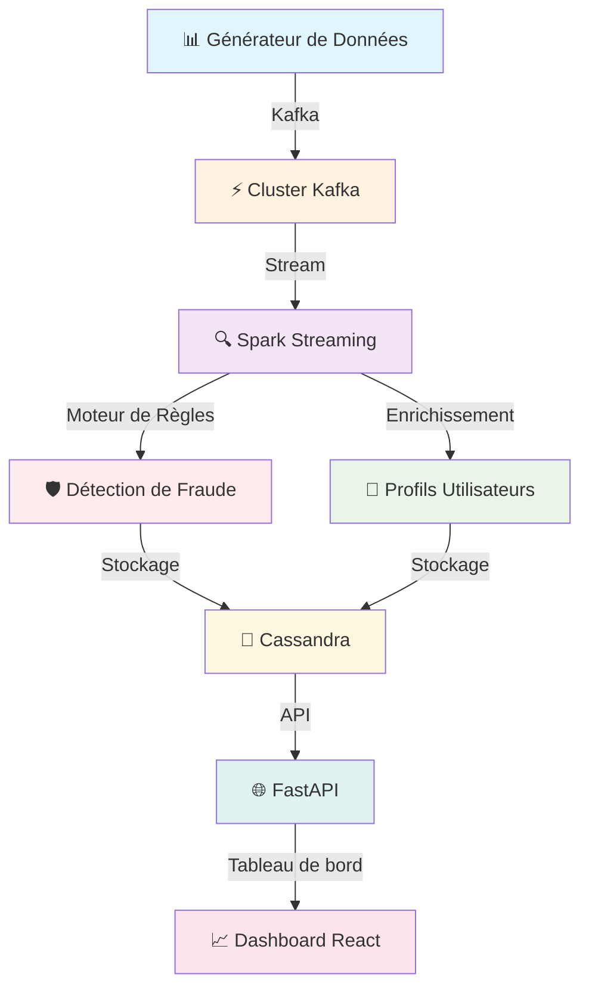
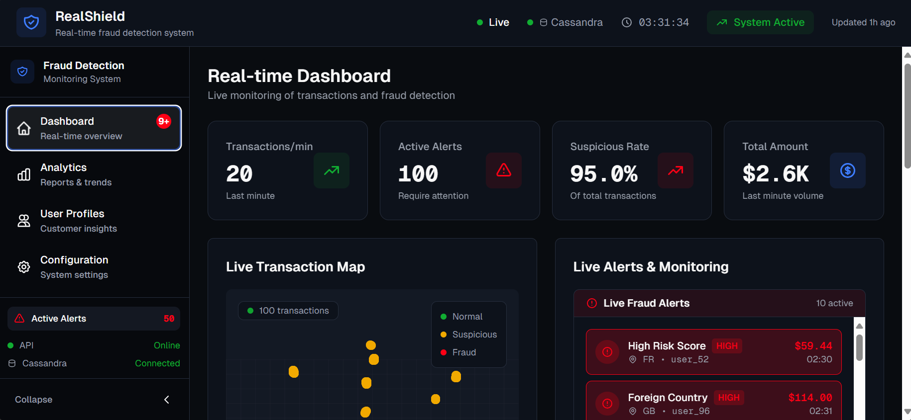
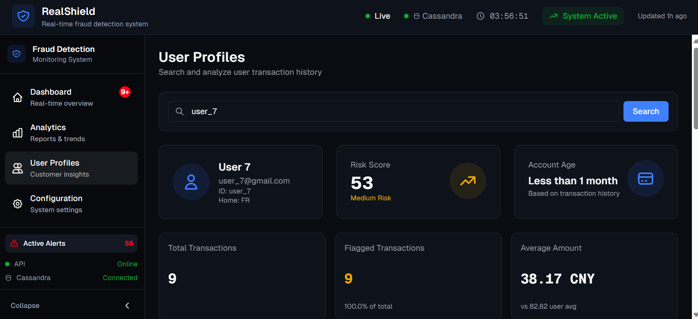

# 🚨 RealShield

<div align="center">


**Un système complet de détection de fraude en temps réel simulant la surveillance de transactions bancaires avec moteur de règles métier**

[Architecture](#-architecture) • [Fonctionnalités](#-fonctionnalités) • [Démarrage Rapide](#-démarrage-rapide) • [Démonstration](#-démonstration) • [Stack Technique](#-stack-technique)

</div>

## 📖 Aperçu

Ce projet implémente un **système de détection de fraude en temps réel de qualité production** qui simule la surveillance de transactions bancaires. Il traite les données de transaction en flux, applique des règles métier sophistiquées pour la détection de fraude et fournit une visualisation en temps réel via un tableau de bord interactif.

### 🎯 Capacités Principales

- **Ingestion de données en temps réel** avec Apache Kafka
- **Moteur de règles métier** pour la détection de fraude
- **Traitement de flux** avec Apache Spark Streaming
- **Stockage scalable** avec Cassandra
- **Tableau de bord moderne** avec React/TypeScript
- **Containerisation complète** avec Docker

---

## 🏗️ Architecture

### Vue d'Ensemble du Système



### 🔄 Flux de Données

1. **Génération de données** → Transactions synthétiques avec motifs de fraude réalistes
2. **Ingestion de flux** → Topics Kafka pour traitement en temps réel
3. **Traitement** → Spark Streaming avec enrichissement et détection
4. **Stockage** → Cassandra pour persistance scalable
5. **Visualisation** → Tableau de bord React avec mises à jour en temps réel

---

## 🚀 Fonctionnalités

### 🔍 Moteur de Détection de Fraude

| Fonctionnalité | Description | Implémentation |
|---------------|-------------|----------------|
| **Voyage Impossible** | Détecte les transactions depuis des locations géographiquement impossibles | Règles Métier |
| **Alerte Montant Élevé** | Signale les transactions > 3x la moyenne utilisateur | Règles Métier |
| **Score de Risque** | Évaluation du risque au niveau utilisateur | Calcul Temps Réel |
| **Pays Étranger** | Détecte les transactions hors du pays de résidence | Règles Métier |

### 📊 Tableau de Bord Temps Réel



#### Composants du Dashboard :
- **🌍 Carte des Transactions Live** - Visualisation géographique en temps réel
- **📈 Métriques KPI** - Transactions/min, alertes actives, taux suspect
- **🚨 Ticker d'Alertes Live** - Notifications de fraude en temps réel
- **📊 Analytics** - Tendances, patterns et insights
- **👤 Profils Utilisateurs** - Historique des transactions et scores de risque

---

## 🛠️ Stack Technique

### Backend & Data Engineering
- **Apache Kafka 3.4** - Streaming de données en temps réel
- **Apache Spark 3.5** - Traitement de flux
- **Cassandra 4.1** - Stockage NoSQL scalable
- **FastAPI** - API REST avec documentation automatique
- **Python 3.9+** - Traitement de données

### Frontend & Visualisation
- **React 18** - Framework UI moderne
- **TypeScript** - Développement type-safe
- **Tailwind CSS** - Styling utility-first
- **Recharts** - Visualisation de données
- **Next.js** - Framework React

### Infrastructure
- **Docker & Docker Compose** - Containerisation
- **Bitnami Spark** - Images Spark prêtes pour la production
- **Confluent Kafka** - Distribution Kafka entreprise

---

## ⚡ Démarrage Rapide

### Prérequis

- Docker & Docker Compose
- Python 3.9+

### 🐳 Déploiement Docker (Recommandé)

```bash
# Cloner le repository
git clone https://github.com/sanogomamadou/project-fraud-real-time-detection.git
cd project-fraud-real-time-detection

# Démarrer tous les services
docker-compose up -d

# Attendre l'initialisation des services (2-3 minutes)
docker-compose logs -f

# Accéder aux applications :
# Dashboard: http://localhost:3000
# Documentation API: http://localhost:8000/docs
# Spark UI: http://localhost:8080
```

### 🔧 Setup Manuel (Développement)

```bash
# 1. Démarrer l'infrastructure
docker-compose up -d

# 2. Générer les profils utilisateurs
python src/generate_user_profiles.py

# 3. Démarrer le générateur de données
python generator/generator.py --bootstrap-server localhost:29092 --topic transactions --rate 2 --num-users 100

# 4. Démarrer Spark streaming (nouveau terminal)
pip install pyyaml pathlib
docker-compose exec spark-master bash  
spark-submit --packages org.apache.spark:spark-sql-kafka-0-10_2.12:3.4.0,com.datastax.spark:spark-cassandra-connector_2.12:3.4.0 /opt/workspace/spark-streaming/fraud_detection.py


# 5. Démarrer l'API (nouveau terminal)
cd api && uvicorn main:app --reload

# 6. Démarrer le dashboard (nouveau terminal)
cd dashboard && npm run dev
```

---

## 📁 Structure du Projet

```
fraud-real-time-project/
├── 🐳 docker-compose.yml          # Orchestration multi-services
├── 📊 dashboard/                  # Frontend React TypeScript
├── 🔌 api/                        # Backend FastAPI
├── ⚡ spark-streaming/            # Jobs de traitement Spark
├── 🎲 generator/                  # Simulation de données
├── 📥 consumers/                  # Consumers Kafka
├── 💾 data/                       # Fichiers de données statiques
└── 📚 docs/                       # Documentation & captures d'écran
```

### Plongée dans les Composants Clés

#### 1. 🎲 Générateur de Données (`generator/generator.py`)
```python
# Génère des motifs de transaction réalistes
- Transactions normales : 95% du trafic
- Motifs de fraude : 5% avec signatures spécifiques
- Modélisation du comportement utilisateur avec patterns géographiques
- Streaming temps réel vers les topics Kafka
```

#### 2. ⚡ Spark Streaming (`spark-streaming/`)
```python
# Pipeline de traitement temps réel
1. Consumer Kafka → Lit les flux de transactions
2. Enrichissement des données → Jointure avec profils utilisateurs
3. Moteur de règles → Applique les règles de détection de fraude
4. Writer Cassandra → Persiste les résultats
```

#### 3. 🌐 Couche API (`api/`)
```python
# Endpoints FastAPI
@app.get("/transactions/feed")     # Flux de transactions temps réel
@app.get("/fraud/alerts")          # Alertes de fraude actives
@app.get("/health")                # Statut de santé du système
```

#### 4. 📊 Tableau de Bord (`dashboard/`)
```typescript
// Composants React temps réel
<TransactionMap />     // Visualisation géographique live
<LiveTicker />         // Flux d'alertes temps réel
<KpiCards />           // Tableau de bord des métriques clés
<AnalyticsContent />   // Analytics avancés
```

---

## 🎯 Règles de Détection de Fraude

### Implémentation des Règles Métier

```python
# Détection Montant Élevé
montant > moyenne_utilisateur * 3

# Anomalies Géographiques  
pays_actuel != pays_résidence_utilisateur

# Contrôle de Vélocité
nombre_transactions > 5 par fenêtre de 10 minutes

# Seuil de Risque
score_risque_utilisateur > 0.7


```

### Types de Fraude Simulés

- **🛫 Voyage Impossible** : Transactions depuis des pays éloignés en peu de temps
- **💸 Montant Anormal** : Dépenses significativement supérieures aux habitudes
- **🌍 Pays à Risque** : Transactions depuis des zones géographiques inhabituelles

---

## 📊 Démonstration & Captures d'écran

### Tableau de Bord Temps Réel

*Surveillance en direct avec cartes KPI et carte des transactions*

### Inspection USER

*Visualisation du profil d'un utilisateur et de ses activités*


---

## 🔧 Documentation API

### Aperçu des Endpoints

| Méthode | Endpoint | Description |
|--------|----------|-------------|
| `GET` | `/transactions/feed` | Flux de transactions temps réel |
| `GET` | `/fraud/alerts` | Alertes de fraude actives |
| `GET` | `/health` | Statut de santé du système |
| `GET` | `/transactions/user/{user_id}` | Transactions spécifiques utilisateur |

### Exemple d'Utilisation

```bash
# Obtenir les transactions récentes
curl "http://localhost:8000/transactions/feed?limit=10"

# Vérifier la santé du système
curl "http://localhost:8000/health"

# Accéder à la documentation API
# http://localhost:8000/docs
```

---

## 🎓 Acquis d'Apprentissage

Ce projet démontre des **compétences avancées en Data Engineering** :

### 🏗️ Architecture & Design
- Architecture microservices avec design event-driven
- Patterns de traitement de flux temps réel
- Stratégies de stockage de données scalable
- Déploiement containerisé

### 🔧 Implémentation Technique
- **Apache Kafka** : Streaming d'événements et messagerie
- **Spark Structured Streaming** : Traitement de données temps réel
- **Cassandra** : Design de base de données haute performance en écriture
- **FastAPI** : Développement d'API web Python moderne
- **React/TypeScript** : Développement frontend de qualité entreprise

### 📈 Concepts de Data Engineering
- Pipelines ETL temps réel
- Enrichissement de données et feature engineering
- Monitoring et observabilité
- Qualité des données et validation

---

## 🚀 Considérations Production

### Stratégies de Scaling
- **Kafka** : Partitionnement et groupes de consumers
- **Spark** : Mode cluster avec multiples workers
- **Cassandra** : Modélisation des données pour les patterns de requête
- **API** : Load balancing et caching

---

## 🤝 Contribution

Ce projet, bien que principalement une démonstration de capacités en Data Engineering, les contributions et suggestions sont les bienvenues !


---

## 📄 Licence

Ce projet est développé à des fins éducatives. Tout le code est disponible pour l'apprentissage et la démonstration.

---

## 👨‍💻 Auteur

**Mamadou SANOGO**  
*Étudiant en BIG DATA & IA*  
- 📧 Email : mamadou.sanogo@uir.ac.ma 
- 💼 LinkedIn : [MAMADOU SANOGO](www.linkedin.com/in/mamadou-sanogo-3b22a9263)  

---


<div align="center">

### ⭐ Si ce projet vous a aidé dans votre parcours d'apprentissage, n'hésitez pas à lui donner une étoile !


</div>
```
